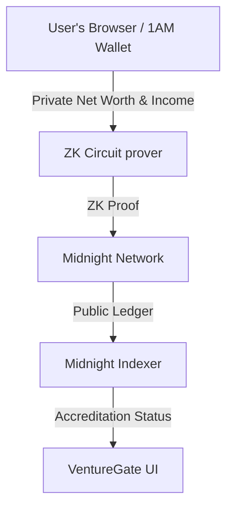

# VentureGate (VaultProof) 💎

[](https://github.com/CodeBugMalik/VaultProof/actions/workflows/ci.yaml)

> Prove you're an accredited investor — without revealing your net worth or income.

VentureGate is a privacy-preserving accredited investor verification portal built on the [Midnight Network](https://midnight.network/). Users prove they meet strict financial requirements (minimum net worth and minimum annual income) to participate in private equity investments, using Zero-Knowledge proofs — without ever revealing their exact financial figures to the platform, the public, or the blockchain.

## Live Demo

- **App:** [https://venturegate.vercel.app](https://venturegate.vercel.app)
- **Contract (Preprod):** `8c34b5c05fe7ae32e5de68635a08d670c9a4ff5049ab2c2f76ffc95597b9082e`
- **Explorer:** [View on Midnight Explorer](https://preprod.midnightexplorer.com/contracts/8c34b5c05fe7ae32e5de68635a08d670c9a4ff5049ab2c2f76ffc95597b9082e)
- **Twitter/X:** [@CodeBugMalik](https://twitter.com/CodeBugMalik)

## The Problem

Traditional accredited investor verification requires users to submit highly sensitive documents (tax returns, bank statements, W-2s) to third-party verification services. This creates massive data honeypots, exposing investors to identity theft and data breaches.

## The Solution

VentureGate uses Zero-Knowledge (ZK) proofs to solve this:
- **Public State**: The smart contract stores the minimum requirements (e.g., $1M net worth, $200k income).
- **Private Witness**: The user's actual financial data remains entirely on their device.
- **ZK Circuit**: The user's device generates a cryptographic proof that their private data satisfies the public requirements. Only this proof is submitted to the blockchain.

## Privacy Model

When a user calls `verify_accreditation`, they prove their net worth and income meet the on-chain thresholds using a Zero-Knowledge proof. The contract verifies the proof without ever seeing the actual numbers.

### An observer CAN see:
- The minimum net worth and income thresholds (public ledger state)
- That a verification transaction was submitted
- Whether the verification succeeded or failed
- The contract address

### An observer CANNOT see:
- The user's actual net worth
- The user's actual annual income
- Any financial documents or data
- Who submitted the verification (there is no `msg.sender` in Midnight)

## Architecture



## Features

- **Zero-Knowledge Verification**: Client-side proof generation via Midnight SDK
- **Institutional Dark-Mode UI**: Built with React, Vite, and custom CSS
- **1AM Wallet Integration**: Seamless connection to the Midnight 1AM browser extension
- **On-chain State**: Immutable and verifiable accreditation status on Midnight Preprod
- **Admin Deployment**: Deploy new contract instances directly from the browser
- **CI/CD Pipeline**: Automated testing with GitHub Actions

## Setup & Local Development

### Prerequisites

- Node.js >= 22.0.0
- Docker Desktop (for local Midnight node/proof server)
- Compact compiler (`compact 0.31.0`) installed in PATH
- 1AM Wallet browser extension (set to Preprod)

### Installation

```bash
# Install root dependencies (for tests/deployment scripts)
yarn install

# Install frontend dependencies
cd frontend
npm install
```

### Compiling the Contract

```bash
yarn compile
```

After compiling, copy managed assets to frontend:
```bash
# Windows PowerShell
Copy-Item -Recurse -Force contracts\managed\venturegate frontend\src\managed
Copy-Item -Recurse -Force contracts\managed\venturegate frontend\public\managed
```

### Running the Frontend (localhost)

```bash
cd frontend
npm run dev
```

Open [http://localhost:5173](http://localhost:5173) in your browser.

### Running Tests (Local Docker Network)

```bash
yarn env:up                # Start local Midnight network
yarn wait:dust             # Wait for DUST tokens
yarn test:local            # Run all 4 tests
yarn env:down              # Stop network
```

### Deploying to Preprod

1. Connect 1AM wallet on Preprod network
2. Open app at http://localhost:5173
3. Go to Admin page → Deploy Contract
4. Copy the resulting contract address

## Contract Details

- **Language:** Compact (`pragma language_version >= 0.22.0`)
- **File:** `contracts/venturegate.compact`
- **Network:** Midnight Preprod
- **Circuits:** `verify_accreditation(net_worth, income)`

### Public Ledger State vs Private Witnesses

| Public (on-chain) | Private (witness — never leaves device) |
|---|---|
| `min_net_worth: Uint<32>` — minimum threshold | User's actual net worth |
| `min_income: Uint<32>` — minimum threshold | User's actual annual income |

## Test Coverage

```
✓ Deploys the contract with VentureGate rules
✓ Verifies eligibility successfully for a qualifying investor
✓ Fails verification for an investor with net worth too low
✓ Fails verification for an investor with income too low

Test Files  1 passed (1)
    Tests  4 passed (4)
```

## Project Structure

```
VentureGate/
├── contracts/
│   ├── venturegate.compact          # Smart contract source
│   ├── index.ts                     # Contract entry point
│   └── managed/venturegate/         # Auto-generated (circuits, keys, zkir)
├── frontend/
│   ├── src/
│   │   ├── lib/midnight.ts          # Core SDK utilities & provider wiring
│   │   ├── contexts/WalletContext.tsx
│   │   ├── pages/                   # Landing, Verify, Admin, About
│   │   ├── components/              # NavBar, Footer, WalletBanner
│   │   └── managed/                 # Contract types (copied from compile)
│   ├── public/managed/              # ZK proving keys (served at /managed/)
│   └── vite.config.ts               # WASM + topLevelAwait plugins
├── src/
│   ├── config.ts                    # Network configs (local/preview/preprod)
│   ├── providers.ts                 # Midnight provider factory
│   ├── wallet.ts                    # Headless wallet for Node.js tests
│   └── test/venturegate.test.ts     # 4 integration tests
├── scripts/
│   ├── deploy.ts                    # Preprod deployment script
│   └── wait-for-dust.ts             # DUST accrual waiter
├── .github/workflows/ci.yaml       # CI/CD pipeline
├── compose.yml                      # Local Docker network
├── package.json                     # Root (tests, compile, Docker)
└── README.md
```

## License

MIT License.
