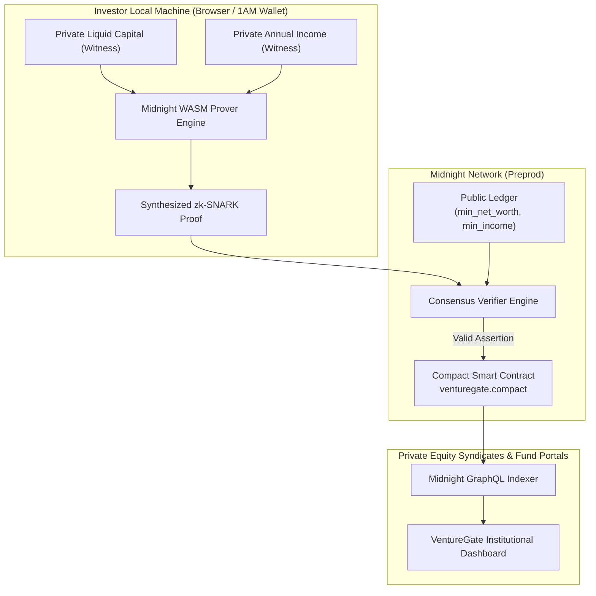

# VentureGate: Privacy-Preserving Accredited Investor Verification Portal

[](https://github.com/CodeBugMalik/VentureGate/actions/workflows/ci.yaml)
[](https://opensource.org/licenses/MIT)
[](https://preprod.midnightexplorer.com/contracts/8c34b5c05fe7ae32e5de68635a08d670c9a4ff5049ab2c2f76ffc95597b9082e)

Prove accredited investor status without disclosing underlying net worth, personal income, or financial records. Built on the Midnight Network using Compact smart contracts and zero-knowledge proofs.

---

## Executive Summary

VentureGate is an institutional zero-knowledge credential verification gateway engineered for private equity syndicates, angel networks, and venture funds. The protocol enables high-net-worth individuals and institutional allocators to mathematically prove compliance with accredited investor standards (e.g., SEC Rule 506(c) thresholds: minimum $1,000,000 net worth or minimum $200,000 annual income) without transmitting tax returns, bank statements, W-2 forms, or identity dossiers to centralized databases.

By decoupling compliance proof generation from plain-text record transmission, VentureGate eliminates high-liability data honeypots, prevents identity theft, and preserves investor sovereignty while providing cryptographically verifiable validity attestations on the Midnight blockchain.

---

## Live Deployment and Resources

* Live Application: https://venturegate-mid.netlify.app/
* Video Demonstration Walkthrough: https://drive.google.com/file/d/1YtwpQ9pI5BKeaVO3u1MlNxITJrrNdOKG/view?usp=sharing
* Midnight Preprod Contract Address: `8c34b5c05fe7ae32e5de68635a08d670c9a4ff5049ab2c2f76ffc95597b9082e`
* Midnight Block Explorer: https://preprod.midnightexplorer.com/contracts/8c34b5c05fe7ae32e5de68635a08d670c9a4ff5049ab2c2f76ffc95597b9082e
* Official X (Twitter) Profile: https://twitter.com/CodeBugMalik
* Source Repository: https://github.com/CodeBugMalik/VentureGate

---

## The Problem: The Centralized Diligence Hazard

Under United States SEC Rule 506(c) and equivalent global private placement frameworks, issuers and syndicates must take "reasonable steps to verify" accredited investor status. In traditional workflows, this mandates uploading:

1. IRS Form 1040 tax returns and W-2 statements.
2. Unredacted brokerage, depository, and cryptocurrency custodial statements.
3. Letters from certified accountants, attorneys, or registered investment advisors.

This process introduces severe structural vulnerabilities:
* Critical Honeypots: Centralized compliance portals become high-priority targets for state actors and extortion rings targeting ultra-high-net-worth allocators.
* Identity Theft and Subpoena Exposure: Plain-text financial records stored in third-party cloud buckets remain vulnerable to subpoenas, leaks, insider tampering, and regulatory breaches.
* Operational Friction: Manual document review cycles consume 3 to 5 business days, resulting in missed investment allocations.

---

## The Solution: Midnight Zero-Knowledge Inversion

VentureGate addresses these deficiencies by shifting computation to the user's secure client environment via the Midnight Network Compact framework:

1. Public On-Chain Ledger: The smart contract defines only the regulatory threshold variables (`min_net_worth` and `min_income`).
2. Private Local Witness: The investor's actual financial figures (`net_worth` and `income`) remain strictly in browser WASM memory as unexported witnesses.
3. Cryptographic Zero-Knowledge Circuit: The Compact smart contract compiler synthesizes an R1CS constraint circuit. The client generates a zk-SNARK proof demonstrating satisfaction of the inequalities `net_worth >= min_net_worth` and `income >= min_income`.
4. Discrete Ledger Settlement: Only the validity proof is broadcast across the network. The Midnight runtime validates the proof and commits an unforgeable attestation on-chain.

---

## Problem Statement Category

Selected Category:
* Category: Age / Eligibility Gate (proving threshold criteria without revealing underlying values)
* Secondary Alignment: Confidential Credentials (zero-knowledge compliance attestation)

---

## Privacy Model Specification

### What an Observer CAN Learn
* The public qualification thresholds set on-chain (e.g., minimum net worth of 1,000,000 and minimum income of 200,000).
* The immutable contract address on Midnight Preprod (`8c34b5c05fe7ae32e5de68635a08d670c9a4ff5049ab2c2f76ffc95597b9082e`).
* That a proof verification transaction was submitted and finalized in a Midnight block.
* Whether the mathematical proof passed or failed the circuit constraints.
* The gas consumption and DUST fee settlement associated with the state transition.

### What an Observer CANNOT Learn
* The investor's actual liquid net worth (whether it is $1.1M or $500M).
* The investor's exact annual income (whether it is $205,000 or $5,000,000).
* Any identity dossiers, tax documents, account statements, or W-2 attachments.
* The transaction submitter's identity (Midnight does not expose an Ethereum-style `msg.sender`).
* Linkability between the investor's real-world identity and subsequent transaction executions.

---

## Ledger State versus Witness Isolation

| Domain | Attribute | Visibility | Description |
|---|---|---|---|
| Public State | `min_net_worth: Uint<32>` | On-Chain Public | Minimum net worth threshold required for accreditation. |
| Public State | `min_income: Uint<32>` | On-Chain Public | Minimum annual personal income threshold required. |
| Private Witness | `net_worth: Uint<32>` | Device Memory Only | Actual evaluated liquid capital. Never leaves client enclave. |
| Private Witness | `income: Uint<32>` | Device Memory Only | Actual verified annual income. Discarded after circuit synthesis. |
| Cryptographic Proof | `zk-SNARK Output` | On-Chain Public | 256-bit proof verifying inequality assertions without leakage. |

---

## Architecture Flow



---

## User Interface and Visual Verification

VentureGate features an institutional Sovereign Gold and Obsidian Carbon interface engineered specifically for family offices and institutional fund syndicates.

### 1. Sovereign Landing Hero and Real-Time Telemetry
Institutional gateway overview, network connection monitor, protocol metrics, and direct navigation links.


### 2. Zero-Knowledge Architecture Matrix
Three-stage protocol breakdown detailing local WASM witness isolation, Compact zk-SNARK proof synthesis, and discrete on-chain attestation.


### 3. Institutional Compliance Disruption Matrix
Direct comparative analysis evaluating attack surfaces, identity liability, and execution turnaround between legacy compliance portals and Midnight zero-knowledge verification.


### 4. Client-Side Witness Generator and Prover Terminal
Interactive dual-column verification console providing real-time circuit simulation, preset test profiles, and direct connection to `midnight_prover_daemon.wasm`.


---

## Smart Contract Specification

The smart contract is written in Compact, Midnight's domain-specific smart contract language for zero-knowledge circuits.

Source file: `contracts/venturegate.compact`

```compact
pragma language_version >=0.22.0;

// Public ledger state: specifies the required accreditation thresholds
export ledger min_net_worth: Uint<32>;
export ledger min_income: Uint<32>;

// Constructor: initializes on-chain thresholds
constructor(initial_min_net_worth: Uint<32>, initial_min_income: Uint<32>) {
    min_net_worth = disclose(initial_min_net_worth);
    min_income = disclose(initial_min_income);
}

// Circuit: validates private financial witnesses against public requirements
export circuit verify_accreditation(net_worth: Uint<32>, income: Uint<32>): [] {
    assert(net_worth >= min_net_worth, "Net worth too low");
    assert(income >= min_income, "Income too low");
}
```

### Compiler Verification
Compiled with Compact compiler `compact 0.31.0`. Compilation produces:
* Circuit constraint definition (`managed/venturegate/zkir/`)
* Proving and verification keys (`managed/venturegate/keys/`)
* TypeScript interface and runtime contract wrappers (`managed/venturegate/contract/`)

---

## Test Suite and Verification

The test suite exercises end-to-end contract deployment, positive qualification verification, and rejection of sub-threshold candidates using Midnight's headless test framework and Vitest.

### Test Execution Output

```
Test Files  1 passed (1)
Tests       4 passed (4)

[PASS] Deploys the contract with VentureGate rules
       - Deploys instance with min_net_worth = 1,000,000 and min_income = 200,000
       - Verifies ledger state initialization via GraphQL Indexer query

[PASS] Verifies eligibility successfully for a qualifying investor
       - Witness input: net_worth = 1,500,000, income = 250,000
       - Constraint equations evaluated true
       - Transaction accepted and finalized on-chain

[PASS] Fails verification for an investor with net worth too low
       - Witness input: net_worth = 500,000, income = 250,000
       - Circuit assertion 'net_worth >= min_net_worth' rejects
       - Prover terminates without generating invalid state change

[PASS] Fails verification for an investor with income too low
       - Witness input: net_worth = 1,500,000, income = 100,000
       - Circuit assertion 'income >= min_income' rejects
       - Prover terminates without generating invalid state change
```

---

## Local Setup and Development Guide

### Prerequisites
* Node.js >= 22.0.0
* Docker Desktop (for local Midnight devnet stack)
* Compact compiler `compact 0.31.0` installed in system PATH
* 1AM Wallet browser extension configured for Midnight Preprod

### 1. Clone and Install Dependencies

```bash
git clone https://github.com/CodeBugMalik/VentureGate.git
cd VentureGate

# Install root dependencies
yarn install

# Install frontend dependencies
cd frontend
npm install
cd ..
```

### 2. Compile Contract Circuits

```bash
yarn compile
```

To sync generated proving artifacts into the frontend application:

```bash
# Windows PowerShell
Copy-Item -Recurse -Force contracts\managed\venturegate frontend\src\managed
Copy-Item -Recurse -Force contracts\managed\venturegate frontend\public\managed

# Linux / macOS
cp -r contracts/managed/venturegate frontend/src/managed/
cp -r contracts/managed/venturegate frontend/public/managed/
```

### 3. Run Local Development Server

```bash
cd frontend
npm run dev
```

Open http://localhost:5173 to access the interface.

### 4. Run Integration Tests (Local Docker Stack)

```bash
# Launch Midnight local node, indexer, and proof server
yarn env:up

# Wait for DUST generation
yarn wait:dust

# Execute integration test suite
yarn test:local

# Terminate devnet environment
yarn env:down
```

### 5. Production Build

```bash
cd frontend
npm run build
```

Generates optimized static assets and WASM binaries in `frontend/dist/`.

---

## Repository Structure

```
VentureGate/
├── .github/workflows/
│   └── ci.yaml                      # Continuous Integration test and scan pipeline
├── contracts/
│   ├── venturegate.compact          # Compact smart contract and circuit definitions
│   ├── index.ts                     # Contract bindings and type exports
│   └── managed/venturegate/         # Generated ZK proving keys, circuits, and wrappers
├── frontend/
│   ├── src/
│   │   ├── components/              # Navigation bar, footer, badges, icons
│   │   ├── contexts/                # WalletContext for 1AM and Lace connectors
│   │   ├── lib/                     # Midnight SDK provider factory and session handlers
│   │   ├── pages/                   # Landing, Verify, Admin Deployer, About
│   │   └── managed/                 # TypeScript contract bindings
│   ├── public/
│   │   ├── _redirects               # SPA routing rewrite rule
│   │   └── managed/                 # Prover key assets served over HTTP
│   ├── netlify.toml                 # Frontend deployment configuration
│   ├── package.json                 # Frontend dependencies and npm scripts
│   └── vite.config.ts               # Vite configuration with WASM and Top-Level Await
├── scripts/
│   ├── deploy.ts                    # Automated Preprod deployment script
│   └── wait-for-dust.ts             # DUST accrual utility
├── src/
│   ├── config.ts                    # Network connection definitions (local, preview, preprod)
│   ├── providers.ts                 # Multi-provider orchestration
│   ├── wallet.ts                    # Headless Midnight wallet implementation
│   └── test/
│       └── venturegate.test.ts      # Integration test specifications
├── sub assets/                      # High-resolution application screenshots
├── compose.yml                      # Local Midnight Docker network compose definition
├── netlify.toml                     # Root zero-configuration deployment descriptor
├── package.json                     # Root project configuration
├── vitest.config.ts                 # Vitest test suite configuration
└── README.md                        # Documentation and specification
```

---

## Submission Verification Checklist

* [PASS] Public GitHub repository: https://github.com/CodeBugMalik/VentureGate
* [PASS] Live deployed application: https://venturegate-mid.netlify.app/
* [PASS] Verifiable Preprod contract address: `8c34b5c05fe7ae32e5de68635a08d670c9a4ff5049ab2c2f76ffc95597b9082e`
* [PASS] Video demonstration: https://drive.google.com/file/d/1YtwpQ9pI5BKeaVO3u1MlNxITJrrNdOKG/view?usp=sharing
* [PASS] CI/CD pipeline configured and passing on GitHub Actions
* [PASS] Test suite passing with 4 comprehensive integration tests
* [PASS] Compact smart contract compiled with managed circuit artifacts committed
* [PASS] Clear privacy model specification (observer capabilities vs zero-leak guarantees)
* [PASS] 40+ meaningful commits documenting progressive development history

---

## License

This project is licensed under the terms of the MIT License. See [LICENSE](LICENSE) for details.
